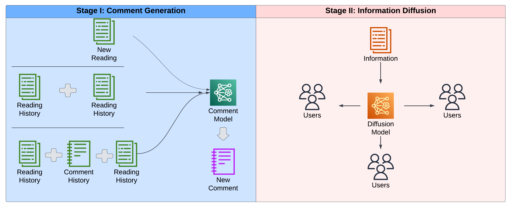

#  🙈 NLP Tunnel Vision (Comment Generation)

## Table of Contents
- [Introduction](#introduction-)
- [Project Structure](#project-structure-)
- [How-to-Run](#how-to-run-)
    - [1. Download data from Kaggle](#1-download-data-from-kaggle)
    - [2. Setup virtual environment](#2-setup-virtual-environment)
    - [3. Prepare data for model fine-tuning](#3-prepare-data-for-model-fine-tuning)
    - [4. Fine-tune model](#4-fine-tune-model)
    - [5. Model inference](#5-model-inference)
    - [6. Run docker container locally (optional)](#6-run-docker-container-locally-optional)
    - [7. Deploy model as a web service (optional)](#7-deploy-model-as-a-web-service-optional)
- [To-Do-List](#to-do-list-)
- [Bugs](#bugs-)

## Introduction 📖
This project is a part of the NLP Tunnel Vision. The overview architecture is shown in following figure. 



The goal of this project is to generate comments for a new article by considering the history of articles and comments of a news reader. The project is divided into four parts:

1. **Data Process**: Download data from Kaggle website and converting it into a specific format.
2. **Model Fine-tunning**: Fine-tune model using the processed dataset.
3. **Model Inferencing**: Generate comment for a given article.
4. **Model Deployment(optional)**: Deploy the model as a web service to Paperspace.

## Project Structure ✨

```bash
    .   
    ├── configure
    │   ├── openai.yaml
    ├── data
    │   ├── processed
    │   │   ├── <processed data>
    │   ├── raw
    │   │   ├── kaggle.json
    │   │   ├── <raw data from kaggle>
    ├── models
    │   ├── <save openai file and model job info>
    ├── scripts
    │   ├── run_fine_tune.sh
    │   ├── run_inference.sh
    │   ├── run_openai_check_job.sh
    │   ├── run_openai_data_formatter.sh
    │   ├── run_openai_data_validation.sh
    │   ├── run_prepare_data.sh
    ├── src
    │   ├── __init__.py
    │   ├── fine_tune.py
    │   ├── inference.py
    │   ├── openai_check_job.py
    │   ├── openai_data_formatter.py
    │   ├── openai_data_validation.py
    │   ├── prepare_data.py
    │   ├── serve.py
    │   ├── utils.py
    ├── .env
    ├── .gitignore
    ├── docker-compose.yml
    ├── Dockerfile
    ├── run.sh
    ├── run_build_and_deployment.sh
    ├── venv.yaml
    ├── README.md
```

## How-to-Run 🚦
### 1. Download data from Kaggle
* Install Kaggle CLI
    ```bash
    pip install kaggle
    ``` 

* Configure Kaggle CLI

    Download `kaggle.json` from Kaggle website and move it to `data/raw` folder. Then run the following command to configure Kaggle CLI.

    ```bash
    mkdir ~/.kaggle
    mv kaggle.json ~/.kaggle
    chmod 600 ~/.kaggle/kaggle.json
    ```
* Download data from Kaggle

    ```bash 
    kaggle datasets download -d benjaminawd/new-york-times-articles-comments-2020
    unzip new-york-times-articles-comments-2020.zip
    ```

### 2. Setup virtual environment

* Install conda
    ```bash
    wget https://repo.anaconda.com/miniconda/Miniconda3-latest-Linux-x86_64.sh
    
    bash Miniconda3-latest-Linux-x86_64.sh -b -p $HOME/miniconda
    ```
* Create and activate virtual environment
    ```bash
    conda env create -f venv.yaml
    conda activate nlp-tunnel-vision
    ```

### 3. Prepare data for model fine-tuning
* Prepare data
    ```bash
    bash scripts/run_prepare_data.sh
    ```
* Convert data to OpenAI format
    ```bash
    bash scripts/run_openai_data_formatter.sh
    ```
* Validate data

    🚨 make sure no error information is printed out
    ```bash
    bash scripts/run_openai_data_validation.sh
    ```

### 4. Fine-tune model
* Fine-tune model

    Add `OPENAI_API_KEY` and key value to `.env` file, then run the following command to fine-tune the model.
    ```bash
    bash scripts/run_fine_tune.sh
    ```
    The processed file will be uploaded to OpenAI server and the file information will be saved in `models/file-xxx.json`.
* Check job status

    To check the job status, run the following command.
    ```bash
    bash scripts/run_openai_check_job.sh
    ```
    If the job is completed, the file `models/ftjob-xxx.json` will be created.

### 5. Model inference
* Generate comment

    Update values of `OPENAI_API_KEY`, `OPENAI_FINE_TUNED_MODEL_ID` (found it in `models/ftjob-xxx.json`), and `OPENAI_TEMPERATURE` in file `src/inference.py`. Also, set some testing data or read from a file to generate comments using fine-tuned model.
    ```bash
    bash scripts/run_inference.sh
    ```

### 6. Run docker container locally (optional)
* Install docker and docker-compose

    Follow the instructions in [docker](https://docs.docker.com/engine/install/ubuntu/) and [docker-compose](https://docs.docker.com/compose/install/) to install docker and docker-compose.

* Build and up docker container

    Before running the docker container, make sure the fine-tuning job is completed and all values in `.env` is updated (including `OPENAI_API_KEY`, `OPENAI_FINE_TUNED_MODEL_ID`, and `OPENAI_TEMPERATURE`). Then run the following command to build and up the docker container locally, and the service will be live (http://127.0.0.1:8080).

    ```bash
    docker compose --env-file .env up --build
    ```
* Send POST request to generate comment

    Use Postman to send a POST request to http://127.0.0.1:8080/infer with the following body to generate comment.
    ```json
    {
        "history": [
                ["This is first test article.", "this is a test comment."],
                ["This is secondary test article", "this is a secondary test comment."]
            ],
        "new_article": "this is a new article."

    }
    ```

### 7. Deploy model as a web service (optional)
* Register Docker Hub account

    Register a [Docker Hub account](https://hub.docker.com/signup) before the following steps and copy account name.

* Install Paperspace CLI

    Follow the instructions in [Paperspace CLI](https://docs.paperspace.com/gradient/cli/) to install and configure Paperspace SDK.

* Set secret values in Paperspace Secrets

    Login Paperspace, create two pairs of name-value in `Paperspace --> Account --> Team settings --> Secrets`: `OPENAI_API_KEY` and `OPENAI_FINE_TUNED_MODEL_ID` (found it in `models/ftjob-xxx.json`).

* Deploy model API to Paperspace

    ```bash
    ./run_build_and_deployment.sh <docker_hub_account_name> <paperspace_api_key> <paperspace_project_id>
    ```

* Send POST request to generate comment

    Use Postman to send a POST request to http://<paperspace_deployment_endpoint>/infer with the following body to generate comment. The deployment endpoint can be found in `Paperspace --> <Project> --> Deployments --> <deployment_name> --> Endpoint`.
    ```json
    {
        "history": [
                ["This is first test article.", "this is a test comment."],
                ["This is secondary test article", "this is a secondary test comment."]
            ],
        "new_article": "this is a new article."

    }
    ```


## To-Do-List ✊
- [ ] Optimize the prompt for model fine-tuning
- [ ] Try different window sizes for the model
- [ ] Create UI for comment generation


## Bugs 🐞
- [ ] The project docker image is build using python 3.10, however, the Paperspace deployment is using python 3.8 because of the Paperspace SDK. Therefore, the project docker image should be built using python 3.8 in the future.